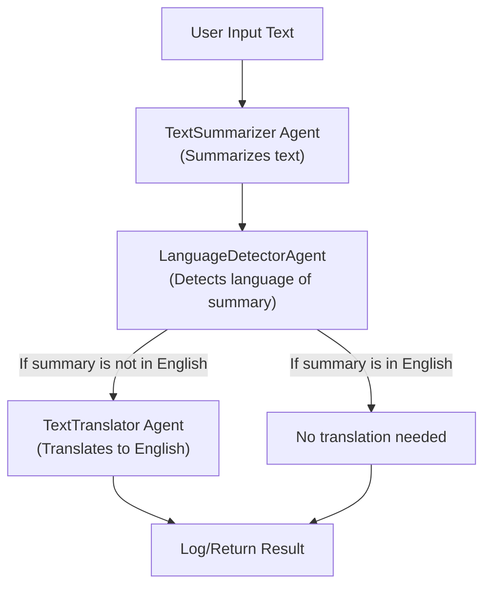

---

## Agent Flow Diagram

## Example Summary

This example chains three agents:
- **Summarizer**: Summarizes input text.
- **Language Detector**: Checks the summary's language.
- **Translator**: Converts the summary to English if needed.

**Uniqueness:**
- Shows sequential agent orchestration with conditional logic.
- Demonstrates modular, single-purpose agents.
- Illustrates real-world multilingual processing in a simple, extensible pipeline.
